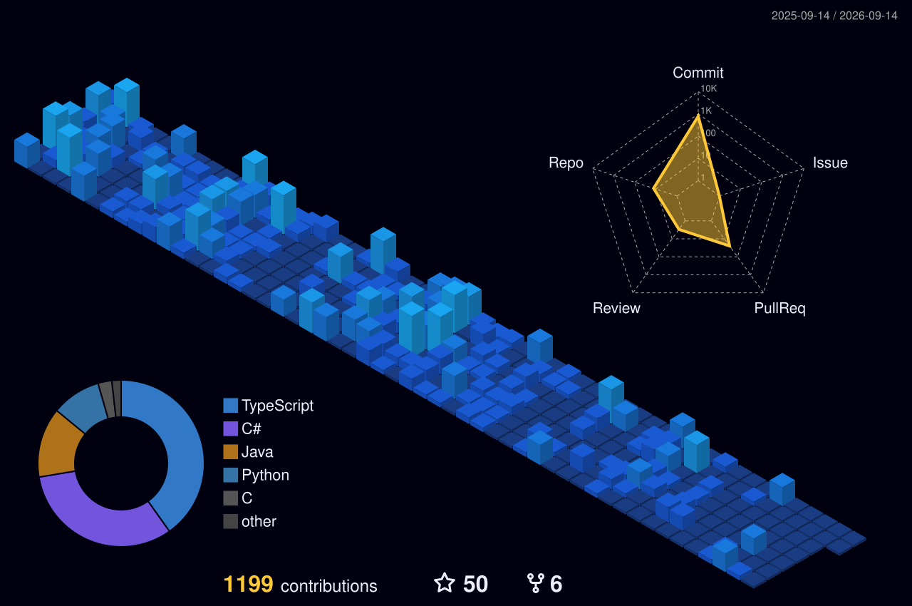

---

## 🚀 About Me

<table>
<tr>
<td valign="top">

- 💻 &nbsp;Backend engineer based in Cairo
- 🎓 &nbsp;Graduate of Cairo University, Faculty of Computers and Artificial Intelligence
- 🐧 &nbsp;Linux daily driver
- 📫 &nbsp;yousseftarekali04@gmail.com

</td>
<td width="200" align="center">
  
</td>
</tr>
</table>

## 💼 Experience

  <table>
    <tr>
      <td align="center" width="200">
        <a href="https://outlier.ai/"><b>Outlier</b></a>
         Coding Expert
      </td>
      <td align="center" width="200">
        <a href="https://www.microsystems-eg.com/"><b>Microsystems Egypt</b></a>
         Backend Intern
      </td>
      <td align="center" width="200">
        <a href="https://www.fawry.com/"><b>Fawry</b></a>
         Fullstack Intern
      </td>
      <td align="center" width="200">
        <a href="https://synapse-analytics.io/"><b>Synapse Analytics</b></a>
         Backend Intern
      </td>
    </tr>
  </table>

## 📌 Featured Projects

<table>
  <tr>
    <td width="33%" valign="top">
      <h3 align="center"><a href="https://github.com/RealOrangeKun/clean-architecture-template-dotnet">🏛️ Clean Architecture Template</a></h3>
      
A .NET 10 modular monolith you can clone and start building on. Clean Architecture, DDD, CQRS and event driven messaging, already wired together.

      

    </td>
    <td width="33%" valign="top">
      <h3 align="center"><a href="https://github.com/RealOrangeKun/askly">❓ Askly</a></h3>
      
A question and answer platform. Semantic search runs on pgvector, with a two layer cache (in memory, then Redis) sitting in front of the reads.

      

    </td>
    <td width="33%" valign="top">
      <h3 align="center"><a href="https://github.com/RealOrangeKun/linuxdle">🐧 Linuxdle</a></h3>
      
A daily guessing game for Linux people. Distros, desktop environments and terminal commands, one new round every day.

      

    </td>
  </tr>
</table>

<a href="https://github.com/RealOrangeKun?tab=repositories">the rest of my repos are over here →</a>

## 🛠️ Tech Stack

<table align="center">
  <tr>
    <td align="center" width="180"><b>💻 &nbsp;Languages</b></td>
    <td align="center"></td>
  </tr>
  <tr>
    <td align="center" width="180"><b>🔧 &nbsp;Frameworks</b></td>
    <td align="center"></td>
  </tr>
  <tr>
    <td align="center" width="180"><b>🗄️ &nbsp;Data & Messaging</b></td>
    <td align="center"></td>
  </tr>
  <tr>
    <td align="center" width="180"><b>☁️ &nbsp;Infra & Ops</b></td>
    <td align="center"></td>
  </tr>
  <tr>
    <td align="center" width="180"><b>🖥️ &nbsp;Environment</b></td>
    <td align="center"></td>
  </tr>
</table>

## 📊 GitHub Analytics

<picture>
  <source media="(prefers-color-scheme: dark)" srcset="https://github-readme-stats-fast.vercel.app/api/?username=RealOrangeKun&show_icons=true&count_private=true&hide_border=false&bg_color=00000000&title_color=7CEBF5&text_color=C9D1D9&icon_color=2D7DE4&border_color=7CEBF5&border_radius=10" />
  <source media="(prefers-color-scheme: light)" srcset="https://github-readme-stats-fast.vercel.app/api/?username=RealOrangeKun&show_icons=true&count_private=true&hide_border=false&bg_color=00000000&title_color=0969DA&text_color=1F2328&icon_color=0969DA&border_color=D0D7DE&border_radius=10" />
  
</picture>
<picture>
  <source media="(prefers-color-scheme: dark)" srcset="https://github-readme-stats-fast.vercel.app/api/top-langs/?username=RealOrangeKun&langs_count=8&layout=compact&hide_border=false&bg_color=00000000&title_color=7CEBF5&text_color=C9D1D9&border_color=7CEBF5&border_radius=10" />
  <source media="(prefers-color-scheme: light)" srcset="https://github-readme-stats-fast.vercel.app/api/top-langs/?username=RealOrangeKun&langs_count=8&layout=compact&hide_border=false&bg_color=00000000&title_color=0969DA&text_color=1F2328&border_color=D0D7DE&border_radius=10" />
  
</picture>

<picture>
  <source media="(prefers-color-scheme: dark)" srcset="https://streak-stats.demolab.com/?user=RealOrangeKun&background=00000000&border=7CEBF5&stroke=7CEBF5&ring=2D7DE4&fire=2D7DE4&currStreakNum=7CEBF5&sideNums=C9D1D9&currStreakLabel=7CEBF5&sideLabels=C9D1D9&dates=8B949E&border_radius=10" />
  <source media="(prefers-color-scheme: light)" srcset="https://streak-stats.demolab.com/?user=RealOrangeKun&background=00000000&border=D0D7DE&stroke=D0D7DE&ring=0969DA&fire=0969DA&currStreakNum=0969DA&sideNums=1F2328&currStreakLabel=0969DA&sideLabels=1F2328&dates=57606A&border_radius=10" />
  
</picture>

Top languages just measures what my public repos happen to be written in. It says nothing about what I'm actually good at.

## 🧊 Contribution Calendar

  <picture>
    <source media="(prefers-color-scheme: dark)" srcset="./profile-3d-contrib/profile-night-view.svg" />
    <source media="(prefers-color-scheme: light)" srcset="./profile-3d-contrib/profile-green-animate.svg" />
    
  </picture>

## 🐍 Watch the Snake Eat My Commits

  <picture>
    <source media="(prefers-color-scheme: dark)" srcset="https://raw.githubusercontent.com/RealOrangeKun/RealOrangeKun/output/snake-dark.svg" />
    <source media="(prefers-color-scheme: light)" srcset="https://raw.githubusercontent.com/RealOrangeKun/RealOrangeKun/output/snake-light.svg" />
    
  </picture>

## 💭 Quote

  <picture>
    <source media="(prefers-color-scheme: dark)" srcset="https://quotes-github-readme.vercel.app/api?type=horizontal&theme=nord" />
    <source media="(prefers-color-scheme: light)" srcset="https://quotes-github-readme.vercel.app/api?type=horizontal&theme=graywhite" />
    
  </picture>

---

  

